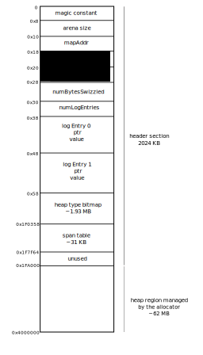

## Introduction
This document describes the growable heap design used for supporting persistent
memory allocations.

## Arenas
Similar to how Go runtime manages the volatile heap, the
persistent memory heap is managed in arenas of sizes that are a multiple
of 64MB.

The below diagram shows the layout of a persistent memory arena of size 64MB:

Each arena is divided into two sections: (i) a header section that contains
arena metadata and (ii) the region managed by the allocator. The arena header
definition can be found in `pmemHeap.go` as `type pArena`.

The arena fields in the metadata section are:
* magic constant - A magic constant used to identify that this is a Go
managed arena. Currently it is just a 8-byte random value, but we plan to
use a checksum value later which can help verify the integrity of the metadata
section.
* arena size - This stores the size of this arena. Size of a persistent memory
arena will be a multiple of 64MB.
* mapAddr - The address at which the arena is mapped during this run of the
program.
* delta - A value that is used to help implement pointer swizzling. Refer to the
pointer swizzling documentation for more details.
* file offset - The offset from the beginning of the file in persistent memory
that corresponds to this arena.
* numBytesSwizzled - This keeps track of how many bytes of data in this arena
have already been swizzled. This is used to identify where to resume any
partially executed swizzling operation.
* numLogEntries - Indicates how many entries in the arena log section is valid.
More details in the undo logging documentation.
* logs - Logs stores the data for the two undo log entries. Each entry takes 16
bytes and contains a pointer and the data.

These fields are followed by the heap type bitmap section and the span table.

The first arena also contains some common metadata about the entire persistent
memory region. This common metadata is placed before the arena related header
data. The following diagram shows the layout of the common header section:

The metadata stored in the common header section are:
* magic constant - An 8 byte string to stamp that this is a Go recongnized
persistent memory file. It can also be used as a version string to identify the
capabilities supported by this file. This magic constant also helps Go runtime
distinguish between a first-run and subsequent runs of the application.
* mappedSize - The persistent memory file is valid up to the size mentioned in
this field. On a restart, if the size of the persistent memory file is found to
be less than this, then an external file truncation has happened. If the file
size is found to be larger than mappedSize, then possibly a crash happened
during heap growth phase.
* root pointer - This is the application root pointer. root pointer is set using
the SetRoot() API. Application accesses all data in persistent memory through
this pointer.
* swizzleState - During reconstruction, swizzleState indicates what stage of
the swizzle process are we currently at. Explained further in the pointer
swizzling documentation.

## Heap Growth
Whenever runtime runs out of persistent memory space, a new arena is added to
the persistent memory file that is a multiple of 64MB. Heap growth can be said
to be complete only when `mappedSize` field in the common header is updated to
the new size. This helps runtime recover from any crash that happens during the
heap growth phase.
