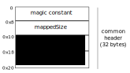

## Introduction

This document details the swizzle algorithm used by the runtime to 'fix'
pointers in a per-arena manner. Pointers found in an arena may need to be
swizzled because the address at which the arena is mapped can change across
application runs.

To keep the swizzle algorithm simple, the runtime supports doing only one
swizzle operation at a time. In case of nested failures, the runtime completes
any previous partially executed swizzling before swizzling the pointers to the
current offset.

## Design

Recall the arena layout and the layout of the common header in the first arena:

**The layout of the common header section in the first arena:**



The relevant header field values are:

* mappedSize: The persistent memory file is valid only up to the size mentioned
in mappedSize. Having mappedSize lets operations related to heap expansion be
done without logging. If an application crash happens during heap growth, on
restart, the runtime considers only `mappedSize` bytes of the file to be valid.
This field also helps to identify if the file was externally truncated while
trying to map it back to memory.

* swizzleState - This field is used to atomically switch the swizzle state.
The possible swizzle states are - `swizzleDone`, `swizzleSetup`,
`swizzleOngoing`.
The swizzle state will be `swizzleDone` before swizzling commences.
When swizzling starts, the state will be set as `swizzleSetup`. This is the
stage when the arena mapped address and delta values of all arenas will be
updated. Before updating these values, they will be logged in the per-arena log
sections.
Once all the arenas have been updated with the new mapped address and delta
values, the swizzle state will be set as `swizzleOngoing`.

**Arena layout (excluding common header):**


The arena header fields are:

* magic constant - A magic number to recognize that this is a go managed arena.
It may also be used as a checksum to validate the metadata in the arena.

* arena size - The size of this arena

* mapAddr - The address at which this arena is mapped. On application restart,
mapAddr is updated with the new mapped address. But if a crash happens in the
middle of a swizzle operation, the mapped address is updated only after the
previous swizzle operation is fully completed.

* delta - The delta value by which pointers pointing into this arena should be
offset by. In case of nested failues, any previous partially executed swizzling
operation is completed with the help of this delta value.

* numBytesSwizzled - This keeps track of how many bytes of data in this arena
have already been swizzled. This is used to identify where to resume any
partially executed swizzling operation.

* numLogEntries - Indicates how many entries in the arena log section is valid.

* logs - Logs stores the data for the two undo log entries. Each entry takes 16
bytes and contains a pointer and the data.

## Logging

The undo log in each arena is used twice during the swizzling operation. When
the swizzle state is `swizzleSetup`, the undo log is used to log the current
values of `mapAddr` and `delta`. Once these values have been logged and updated
for all arenas, the swizzle state is set as `swizzleOngoing`.

Once swizzling is ongoing, the log area is used to log `numBytesSwizzled` and
the pointer value currently being offset in that arena.

## Algorithm

We use three volatile datastructures to aid in the swizzling process
1. `arenaTable[]` - given an address `x`, find which arena would have contained
this address. This is computed from the `mappedAddr` and `delta` field in each
arena header.
2. `arenaMap[]` - In this run, at what address is each arena mapped at.
3. `offsetTable[]` - offset by which a pointer that points to arena i should be
offset by. This is computed using `delta`, `mappedAddr` fields in each arena,
and using `arenaMap[]`.

The following is a simplified algorithm used for the swizzle operation.

**Initialization function**
```go
1. func PmemInit(file string)
2.     // let headerSize indicate size of the common header section
3.     map the common header section of the persistent memory file into memory
4.     if header magic == MAGIC, firstInit = true, else false
5.     if firstInit:
6.         set the values in the common header section
7.         atomically update mappedSize as headerSize
8.    else:
9.         numArenas := (mappedSize-headerSize) / arenaSize
10.
11.        // Let A[i] indicate the metadata for arena i
12.
13.        for i:= 0; i < numArenas; i++
14.            // It would be good to map arena i at the same location that it was
15.            // mapped at the previous run. To do this, map the first page of the
16.            // arena first, read the mappedAddr of the arena, unmap the mapped
17.            // section and then map the full arena with mappedAddr as the hint
18.            // address.
19.            map arena i
20.            store arena map information in arenaMap[i]
21.
22.        if swizzleState is swizzleSetup:
23.            // There was a swizzle setup operation happening which did not complete
24.            // Revert the log entries (if any) found in each arena
25.            // This would revert any partial updates to mappedAddr and delta value of each arena
26.            atomically set swizzleState as swizzleDone
27.
28.        if swizzleState is swizzleOngoing:
29.            // There was a swizzle ongoing previously that has to be completed first
30.            populate arenaTable[] using mapAddr and delta in each arena
31.            populate offsetTable[] from the delta value in each arena
32.            Revert log entries (if any) found in each arena
33.            for i:= 0; i < numArenas; i++
34.                skip := A[i].numBytesSwizzled
35.                go swizzle(i, skip)
36.
37.                // When pointers in all arenas are fixed up
38.                atomically set swizzleState as swizzleDone
39.
40.          // At this point, any partially completed swizzle operation from previous
41.          // runs is completed. If swizzling is required for this initialization,
42.          // do that now
43.
44.          for i := 0; i < numArenas; i++
45.              // numBytesSwizzled can be set as 0 without logging. Swizzling is considered
46.              // to have started only when swizzleState is swizzleOngoing
47.              set A[i].numBytesSwizzled as 0
48.
49.          offsetTable[] and arenaTable[] values have to be recomputed using arenaMap[],
50.          mappedAddr and delta value in each arena
51.
52.          atomically set swizzleState as swizzleSetup
53.          for i := 0; i < numArenas; i++
54.              // Do the following logging in the per-arena log section
55.              log(&A[i].mappedAddr)
56.              log(&A[i].delta)
57.              A[i].mappedAddr <- new mapped addr of this arena
58.              A[i].delta <- new delta value for this arena
59.
60.
61.          atomically set swizzleState as swizzleOngoing
62.
63.          for i:= 0; i < numArenas; i++
64.              go swizzle(i, 0)
65.
66.          when all goroutines return, atomically set swizzleState as swizzleDone

```

**Swizzle function**
```go
1. func swizzle(i, skip int)
2.         // This function swizzles all pointer in arena i. skip is the number of
3.         // bytes of data to skip before starting to swizzle.
4.
5.         // Ignore 'skip' bytes of data before beginning to swizzle
6.
7.         for each remaining pointer p
8.                 // Here p is the address of a memory region in arena i which contains a pointer
9.                  ai := arenaTable[*p]
10.                 off := offsetTable[ai]
11.
12.                 // The following log is stored in the per-arena log section
13.                 log(&A[i].numBytesSwizzled)
14.                 log(p)
15.
16.                 *p = (*p) + off
17.                 A[i].numBytesSwizzled += 1
18.
19.                 commit()
```
